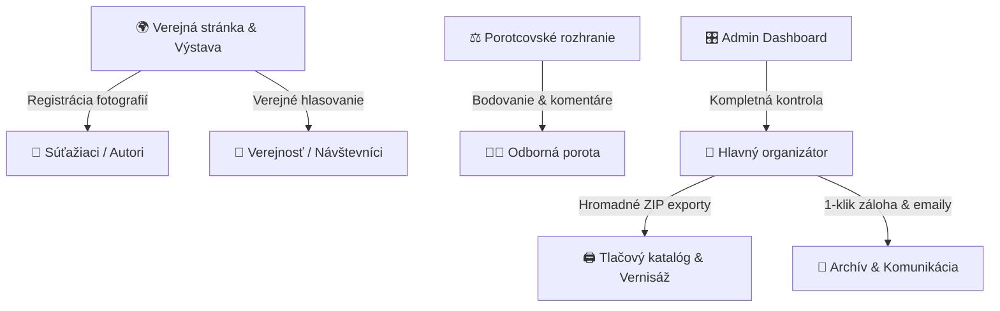

# 📸 SpeleoFoto Platforma: Komplexný manuál & Prezentačný sprievodca systémom

> **Moderná, modulárna a plne automatizovaná platforma pre organizáciu fotografických, umeleckých a environmentálnych súťaží s online výstavou, porotcovským systémom a verejným hlasovaním.**

---

## 🌟 1. Úvod a obrazná metafora systému

Predstavte si tradičnú fotosúťaž v minulosti:
*Stovky papierových prihlášok, desiatky CD nosičov alebo USB kľúčov doručených poštou, nekonečné excelovské tabuľky s menami autorov, neprehľadná komunikácia cez e-maily a porota tlačiaca sa v jednej miestnosti nad hromadami vytlačených fotiek.*

**Naša platforma prenáša celý tento proces do moderného digitálneho priestoru a funguje ako kombinácia troch kľúčových inštitúcií:**
1. **🏛️ Prestížna výkladná galéria:** Reprezentatívny, elegantný a dvojjazyčný priestor, kde súťažné diela vyniknú v plnej kráse bez rušivých prvkov.
2. **⚖️ Diskrétna hodnotiaca sieň:** Chránené prostredie pre odbornú porotu, kde každý porotca hodnotí anonymizované diela odkiaľkoľvek na svete vo vlastnom tempe.
3. **🎛️ Riadiaca veža organizátora:** Výkonný administračný panel, kde organizátor jedným kliknutím spravuje stovky diel, kontroluje štatistiky, exportuje podklady pre tlač výstavného katalógu a komunikuje s autormi.

---

## 🏛️ 2. Pre koho je platforma určená?

Platforma bola navrhnutá s dôrazom na flexibilitu, eleganciu a nulovú technickú záťaž pre organizátora. Je ideálnym riešením pre:

* **Múzeá a galérie** (tematické výstavy, súťaže pre návštevníkov, digitalizácia archívov).
* **Ochranárske spolky, jaskyniarske a turistické organizácie** (environmentálne a prírodovedné fotosúťaže).
* **Mestá, obce a kultúrne strediská** (mestské fotosúťaže, zachytenie života a histórie regiónu).
* **Fotokluby, univerzity a umelecké školy** (ročníkové a medzinárodné súťažné prehliadky).

---

## 💎 3. Architektúra a 5 hlavných pilierov platformy

---

### PILIER 1: Verejný portál, Reprezentatívna galéria a Pravidlá
*Laický opis: „Výkladná skriňa vašej súťaže.“*

* **Dvojjazyčnosť na jedno kliknutie (SK / EN):** Kompletné rozhranie, štatút súťaže, kategórie aj prihlášky sú dostupné v slovenskom a anglickom jazyku.
* **Časová os a harmonogram:** Návštevníci jasne vidia kľúčové míľniky (Uzávierka prihlášok, Hodnotenie poroty, Verejné hlasovanie, Slávnostná vernisáž).
* **Interaktívna galéria diel:** Umožňuje filtrovanie podľa kategórií, vyhľadávanie autorov a plynulé prezeranie fotografií na celú obrazovku s detailnými technickými údajmi (EXIF, príbeh fotografie, technické nastavenia fotoaparátu).
* **OpenGraph sociálne náhľady:** Pri zdieľaní odkazu na Facebooku, Instagrame, WhatsAppe či LinkedIne sa automaticky vygeneruje lákavá grafická karta s logom a popisom súťaže.

---

### PILIER 2: Inteligentná registrácia a nahrávanie fotografií
*Laický opis: „Prihláška bez stresu a bez technických chýb.“*

* **Drag & Drop odovzdanie diel:** Autor jednoducho potiahne svoje fotografie myšou alebo ich vyberie zo smartfónu.
* **Automatické overovanie pravidiel súťaže v reálnom čase:**
  * Stráži povolený počet fotografií na autora (napr. max. 3 v Kategórii A, max. 3 v Kategórii B).
  * Kontroluje minimálne rozlíšenie (napr. min. 3000 px na dlhšej strane pre potreby veľkoformátovej tlače).
  * Kontroluje maximálnu veľkosť súboru (až do 50 MB na fotografiu).
* **Neviditeľný digitálny laborant (Spracovanie obrazu):**
  * **Pôvodný originál** sa bez straty kvality bezpečne uloží do chráneného archívu pre tlačený katalóg.
  * **Webový náhľad** sa automaticky skonvertuje do ultra-rýchleho a moderného formátu WebP pre bleskové načítanie aj na slabom mobilnom pripojení.
  * **Inteligentná EXIF Auto-Rotácia:** Systém automaticky prečíta metadáta zo senzora fotoaparátu/mobilu a narovná fotografie, ktoré boli odfotené na výšku.
* **Automatický potvrdzujúci e-mail:** Okamžite po odoslaní prihlášky príde autorovi formálny, graficky formátovaný e-mail so zoznamom všetkých prihlásených diel, ich kategóriami a parametrami.

---

### PILIER 3: Diskrétne rozhranie pre odbornú porotu
*Laický opis: „Spravodlivá a nerušená hodnotiaca komisia.“*

* **Unikátne prístupové odkazy bez nutnosti registrácie:** Každý porotca obdrží svoj vlastný zabezpečený odkaz (napr. `/jury/porotca-novak-8f92`). Nemusí si pamätať heslá ani prechádzať zložitou registráciou.
* **Anonymizované posudzovanie:** Porotca vidí iba samotnú fotografiu, jej názov a kategóriu. Meno autora a kontaktné údaje sú skryté, aby sa zaručila 100% objektivita.
* **Bodovanie v reálnom čase:**
  * Hodnotenie známkami / bodmi (napr. 1 až 10 hviezdičiek).
  * Možnosť pripojiť internú textovú poznámku alebo slovné hodnotenie pre organizátora.
* **Priebežný progres porotcu:** Porotca presne vidí, koľko fotografií už ohodnotil a koľko mu ešte zostáva (napr. *„Ohodnotené: 78 / 84 fotiek“*).
* **Okamžitá agregácia výsledkov:** Organizátor v administrácii okamžite vidí rebríček diel zoradený podľa priemerného skóre od všetkých porotcov.

---

### PILIER 4: Verejné hlasovanie (Cena diváka)
*Laický opis: „Zapojenie širokej verejnosti a virálny dosah súťaže.“*

* **1-klikové hlasovanie s ochranou proti podvodom:** Návštevníci môžu prideliť hlas svojim favoritom.
* **Inteligentné obmedzenie viacnásobného hlasovania:** Systém využíva kombináciu IP hashovania, klientskych odtlačkov a časových zámkov, aby zabránil umelému nafukovaniu hlasov automatickými skriptami.
* **Harmonogramová aktivácia:** Verejné hlasovanie sa v administrácii zapína a vypína jedným prepínačom alebo podľa vopred nastaveného dátumu.

---

### PILIER 5: Riadiace centrum (Admin Dashboard & Analytics)
*Laický opis: „Režisérsky pult pre organizátora súťaže.“*

* **Komplexný prehľad a štatistiky:**
  * Celkový počet fotografií, registrovaných autorov a hlasov.
  * Porovnanie kategórií (podiel fotiek, počet unikátnych autorov, fotky s príbehom, priemerné body).
  * Interaktívna časová os nahrávania (graf zachytávajúci aktivitu v jednotlivé dni pred uzávierkou).
* **Pokročilá správa fotografií (Tabuľka aj Vizuálna mriežka):**
  * **Zoradenie podľa ľubovoľného stĺpca:** Názov, Autor, Kategória, Dátum a čas nahratia, Bodovanie poroty, Hlasy divákov, Krátky výber (Shortlist).
  * **Blesková kontrola a rotácia (Next / Prev / Rotate 90°):** Kliknutím na fotku sa otvorí plnoobrazovkový prehliadač. Organizátor môže pomocou klávesových šípok (`←` / `→`) prechádzať všetky fotky a stlačením šípky hore (`↑`) nesprávne otočenú fotku okamžite otočiť o 90° s okamžitým uložením na server.
  * **Hromadné operácie (Bulk Actions):** Označenie viacerých fotiek naraz -> hromadný presun medzi kategóriami, hromadné zmazanie, alebo hromadné stiahnutie vybraných diel.
* **1-Klikové exporty pre tlačiarov a grafikov:**
  * **Kompletný ZIP archív originálov:** Stiahne všetky prihlásené fotografie v pôvodnom plnom rozlíšení.
  * **Excel / CSV / JSON export dát:** Kompletná databáza autorov, e-mailov, názvov diel, EXIF údajov a finálnych bodov poroty pre potreby tlače katalógu, diplomov a štítkov na výstavu.
* **Komunikačné centrum s autormi:** Možnosť priamo z prostredia systému poslať autorovi e-mailovú správu (napr. žiadosť o doplňujúce informácie alebo pozvánku na vernisáž).
* **1-Kliková kompletná záloha systému:** Okamžité stiahnutie kompletného dátového archívu celého ročníka do jedného súboru.

---

## 🛠️ 4. Technická špecifikácia & Bezpečnosť

| Parameter | Technické riešenie | Výhoda pre inštitúciu |
| :--- | :--- | :--- |
| **Frontend technológia** | React 18, TypeScript, Tailwind CSS, Framer Motion | Blesková odozva, moderný dizajn, žiadne preblikávanie stránok, perfektné fungovanie na mobiloch, tabletoch aj PC. |
| **Backend architektúra** | Ľahký PHP 8.x REST API Engine | Nevyžaduje drahé cloudové servery. Funguje na akomkoľvek bežnom webhostingu (WebSupport, Forpsi, Active24 atď.). |
| **Dátové úložisko** | Transakčné JSON databázy s atomickým zápisom | Žiadne zložité nastavovanie SQL databáz. Jednoduchá prenosnosť, nulová údržba, 100% zálohovateľnosť. |
| **Spracovanie obrazu** | GD Knižnica s EXIF parserom a WebP kompresiou | Automatické generovanie webových miniatúr, optimalizácia rýchlosti a zachovanie nedotknutých originálov. |
| **Bezpečnosť a ochrana** | JWT Tokeny, bcrypt heslá, Honeypot antispam, Rate Limiting | Ochrana pred hekermi, spambotmi a neoprávneným prístupom do hodnotenia. |
| **E-mailové notifikácie** | SMTP Socket engine s PHP mail fallbackom | Spoľahlivé doručovanie potvrdení o registrácii a komunikácie bez závislosti na platených bránach. |

---

## 💼 5. Prečo je táto platforma výhodná pre inštitúcie a sponzorov?

### 1. Nulové mesačné poplatky za prenájom (SaaS)
Mnohé komerčné súťažné platformy stoja stovky až tisíce eur ročne a účtujú si poplatky za každú prihlášku. Táto platforma je majetkom inštitúcie – prevádzkujete ju na vlastnej doméne a hostingu bez akýchkoľvek skrytých priebežných platieb.

### 2. Dátová nezávislosť a GDPR súlad
Všetky dáta, autorské fotografie a e-mailové kontakty sú uložené výhradne na vašom vlastnom serveri. Žiadne tretie strany k nim nemajú prístup a nevyužívajú ich na trénovanie AI modelov ani marketing.

### 3. Možnosť každoročného opakovania (Ročníkový model)
Systém je pripravený na viacero ročníkov (2026, 2027, 2028...). Po skončení aktuálneho ročníka stačí jedným kliknutím stiahnuť zálohu, archivovať výsledky a spustiť nový ročník s novými kategóriami a termínmi.

### 4. Prispôsobiteľnosť na mieru identity inštitúcie
Farby, typografia, logá partnerov a sponzorov, pravidlá a kategórie sú plne konfigurovateľné cez administračný panel bez potreby zásahu programátora.

---

## 📋 6. Návod na obsluhu: Krok za krokom

### A. Ako súťaží autor:
1. Otvorí webovú stránku súťaže na počítači alebo v mobile.
2. V sekcii **Registrácia / Prihláška** vyplní svoje meno, e-mail a voliteľné bydlisko/klub.
3. Presunie svoje fotografie do vybraných kategórií (napr. Kat. A – Krása jaskýň, Kat. B – Speleomoment).
4. Ku každej fotografii doplní názov a voliteľný príbeh/popis.
5. Klikne na **„Odoslať súťažné fotografie“**.
6. Okamžite dostane potvrdzujúci e-mail s rekapituláciou.

### B. Ako hodnotí porotca:
1. Porotca obdrží e-mailom svoj unikátny odkaz na hodnotenie.
2. Po otvorení odkazu sa mu zobrazí elegantná galéria anonymizovaných diel.
3. Kliknutím na fotku sa zobrazí veľký náhľad.
4. Porotca pridelí počet bodov (1 – 10) a prípadne zapíše poznámku.
5. Klikne na „Ďalšia fotografia“ (alebo použije šípku na klávesnici).
6. Po ohodnotení všetkých diel sa jeho hodnotenie automaticky uzavrie.

### C. Ako riadi súťaž administrátor:
1. Prihlási sa do administrácie na adrese `/admin` so zabezpečeným heslom.
2. V záložke **Prehľad & Štatistiky** sleduje prírastok diel v reálnom čase.
3. V záložke **Fotografie** kontroluje prihlásené diela:
   - Pomocou radenia stĺpcov sleduje najnovšie príspevky.
   - Pri zle otočených fotkách stlačí kláves `↑` a fotka sa automaticky otočí.
   - Výnimočné diela môže označiť štítkom **Shortlist** (Užší výber na výstavu).
4. V záložke **Porota** vytvorí profily porotcov a skopíruje im prihlasovacie odkazy.
5. Po uzávierke klikne na **„Stiahnuť originály (ZIP)“** a odovzdá podklady grafickému štúdiu pre tlač výstavných panelov a katalógu.

---

## 🎯 7. Záver a kontaktné informácie

Platforma **SpeleoFoto** predstavuje overené, robustné a vizuálne prémiové riešenie, ktoré šetrí organizátorom stovky hodín manuálnej práce a účastníkom prináša moderný, bezproblémový zážitok.

* **Technický stack:** React 18 / TypeScript / Tailwind CSS / PHP REST Engine
* **Autor & Vývoj:** Slovenská speleologická spoločnosť / Speleofotografia tím
* **Web:** [speleof26.sss.sk](https://speleof26.sss.sk)
